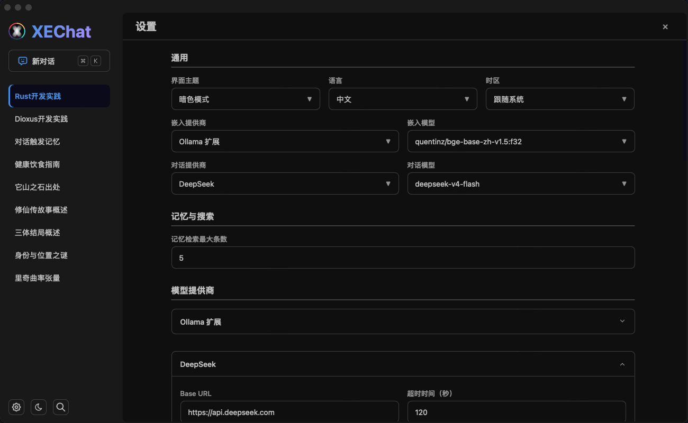
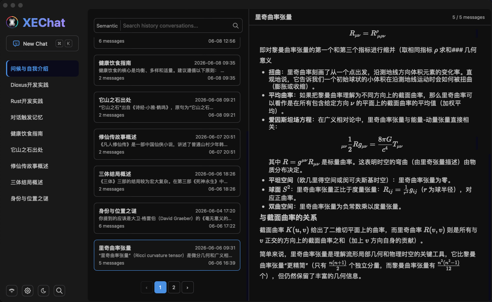
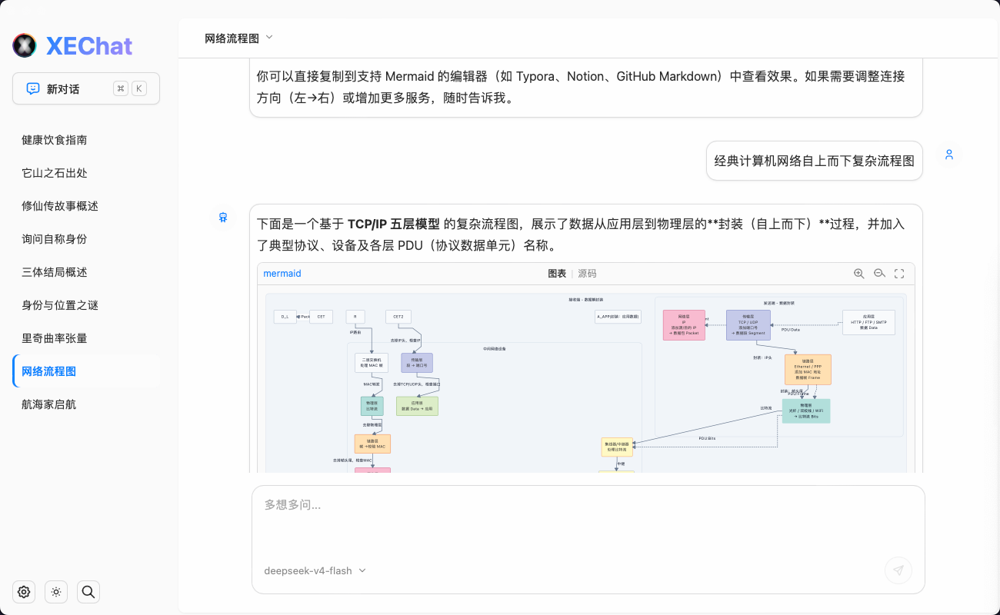

# XEChat

一款基于 Dioxus 的桌面 AI 聊天客户端，支持多模型提供商、智能记忆、语义搜索。

|                           |                        |                      |
|---------------------------|------------------------|----------------------|
|  |  |  |

## 特性

- **多模型支持** — DeepSeek、OpenAI、Ollama 及任意 OpenAI 兼容服务
- **流式对话** — SSE/NDJSON 实时流式输出，支持推理过程展示
- **智能记忆** — 本地 Qwen3-Embedding 嵌入 + LanceDB 向量检索，自动记忆关联对话
- **语义搜索** — 全文搜索 + 向量检索混合搜索，快速定位历史对话
- **本地优先** — 所有数据本地存储（LanceDB），API Key 支持环境变量引用
- **跨平台** — macOS / Linux / Windows，透明标题栏 + 原生体验
- **国际化** — 中文 / 英文双语支持

## 快速开始

### 安装

```bash
# 克隆仓库
git clone https://github.com/xlanger/xechat.git
cd xechat

# 开发运行
cargo run
# 或者
dx serve

# Release 构建
cargo build --release
```

### 配置

首次启动会在平台标准路径创建默认配置：

| 平台 | 配置路径 |
|------|---------|
| macOS | `~/Library/Application Support/XEChat/config.toml` |
| Linux | `~/.config/xechat/config.toml` |
| Windows | `%APPDATA%\XEChat\config.toml` |

编辑配置文件设置 API Key：

```toml
model = "deepseek-v4-flash"
model_provider = "deepseek"

[model_providers.deepseek]
api_key = "${DEEPSEEK_API_KEY}"
base_url = "https://api.deepseek.com"
```

或设置环境变量：

```bash
export DEEPSEEK_API_KEY="sk-xxx"
```

详细配置说明参见 [configuration.md](docs/configuration.md)。

## 架构

XEChat 采用五层架构，实现 UI 与业务的完全解耦：

```
views/        视图层 → 页面组合 + 页面级组件
components/   组件层 → 纯展示，只消费 Signal
hooks/        粘合层 → Context 桥接
stores/       状态层 → Signal 持有者，业务规则
services/     服务层 → 纯 async I/O
models/       模型层 → 纯 DTO，零依赖
```

详细架构设计参见 [ARCHITECTURE_DESIGN.md](docs/ARCHITECTURE_DESIGN.md)。

## 技术栈

| 层级 | 技术 |
|------|------|
| UI 框架 | Dioxus 0.7 (Desktop) |
| 样式 | SCSS + dioxus_style（fork 改良的作用域样式 crate） |
| 向量数据库 | LanceDB |
| 本地嵌入 | embellama (Qwen3-Embedding GGUF) |
| Markdown | comrak + KaTeX + Mermaid |
| 国际化 | rust-i18n |

## 文档

| 文档 | 说明 |
|------|------|
| [架构设计](docs/ARCHITECTURE_DESIGN.md) | 五层架构、数据流、Provider 架构、记忆管线 |
| [开发文档](docs/development.md) | 项目结构、组件树、状态管理、样式开发、测试 |
| [配置说明](docs/configuration.md) | 完整配置示例、环境变量、Provider 路由规则 |
| [打包指南](docs/packaging.md) | macOS/Linux/Windows 打包流程 |

## License

MIT
